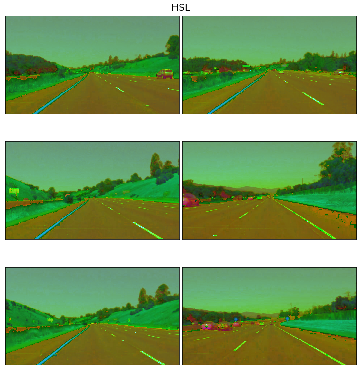
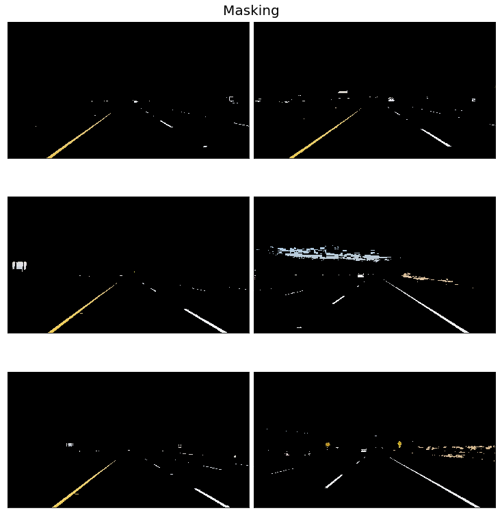
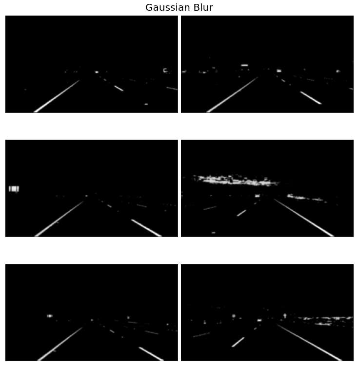
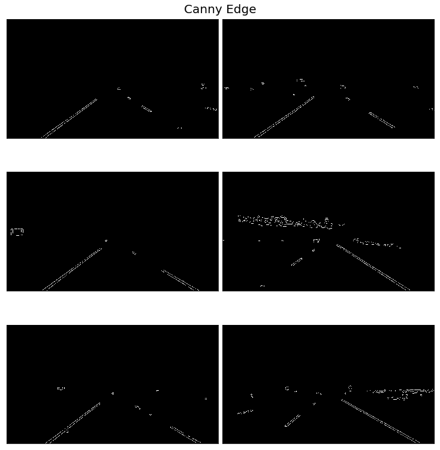
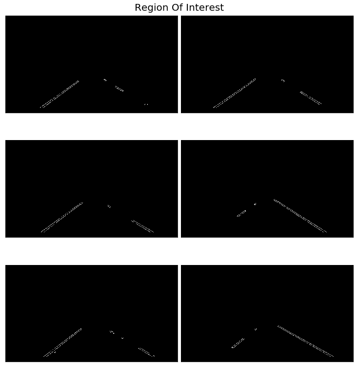
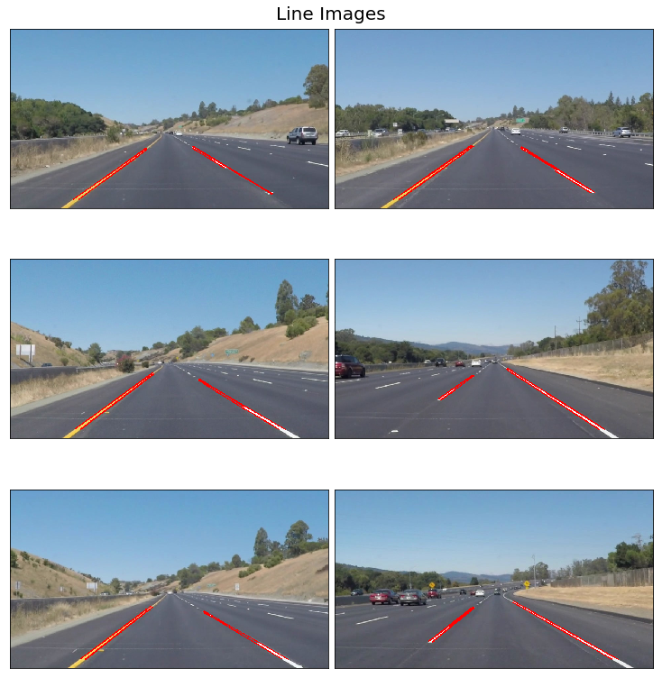
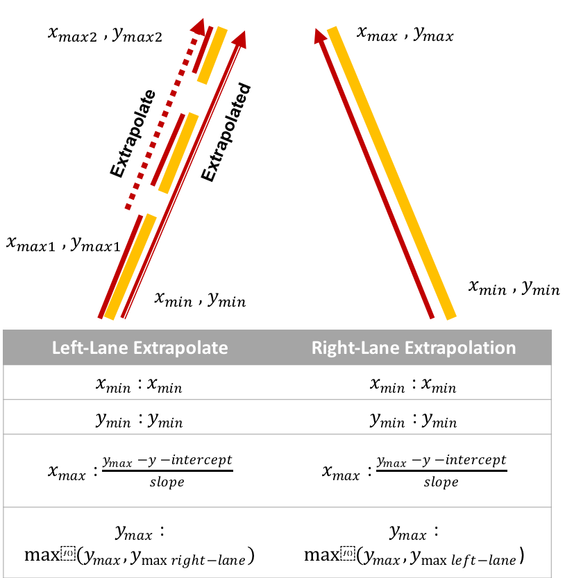
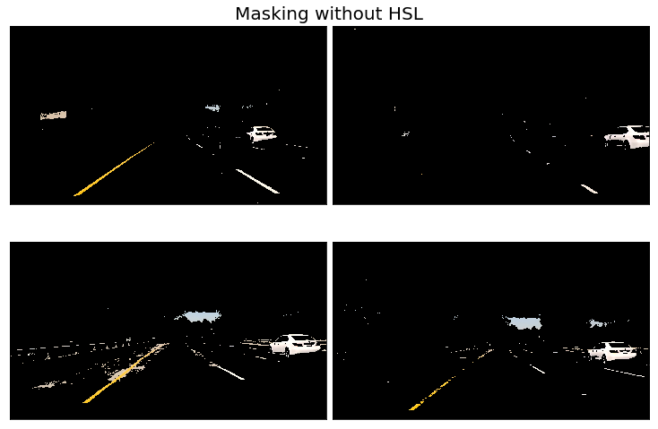
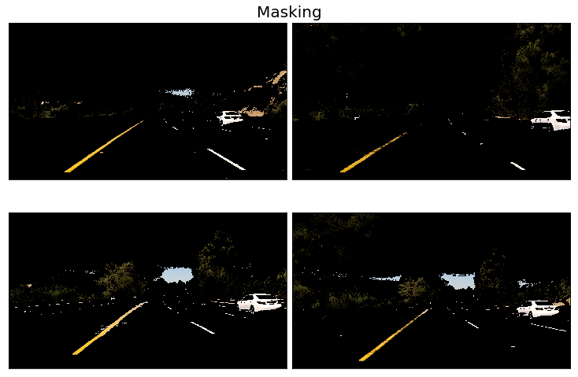

# **Finding Lane Lines on the Road** 

## Writeup

---

### Reflection

### 1. Describe your pipeline. As part of the description, explain how you modified the draw_lines() function.

#### Test Images

The belows are the test images which is used for this project. These images can find [here]((https://github.com/jeongwhanchoi/CarND-LaneLines/tree/master/test_images)).

### A Lane Finding Pipeline

#### 1. Convert RGB to HSL color

I knew this converting method via [Naoki Shibuya's Medium Blog](https://towardsdatascience.com/finding-lane-lines-on-the-road-30cf016a1165) . This method is converting the RGB color model to the HSL color model. It can solve the problem that yellow lines are not clearly because of shadows in the 'Optional Challenge' images.

#### 2. Color Masking

Not converting to HSL color model: the range of color codes is below.

white: (200, 200, 200) ~ (255, 255, 255)

yellow: (190, 190, 190 ~ (255, 255, 255)

Converting RGB to HSL color model: the range of color codes is below.

white: (0, 200, 0) ~ (255, 255, 255): green ~ white

yellow: (10, 0, 100) ~ (40, 255, 255): navy blue ~ cyan blue

`bitwise_or` and `bitwise_and` are used with those range to mask the color except for yellow and white color.

#### 3. Grayscale

The result of masking above is processed as `cv2.COLOR_RGB2GRAY` as follows.

#### 4. Gaussian Blur

The gaussian blur is used to reduce image noises and details. To improve on Canny edge detection, edges in images should be smooth. 

[Improvement on Canny edge detection](https://en.wikipedia.org/wiki/Canny_edge_detector#Improvement_on_Canny_edge_detection)

#### 5. Canny Edge

Applying Gaussian filter, find the edges through canny edge detection algorithm.

The edge is the part where the intensity of the image changes abruptly, so the edge can be found through the derivative value.

#### 4. ROI

In the above Canny edge detection results, not only the road but also the sky and surrounding objects are detected. To solve this problem, a region of interest must be selected.

The vertices are set to define the ROI and mask it to black except for the ROI.

#### 7. Hough Lines

Using the hough transform can be found the lines.

#### 8. Weighted Image

##### Average Lines

Since several lines are detected in one lane, they should be averaged.

##### Extrapolate

In case of dotted lanes, the length of the lane should be extended by using the Extrapolation Algorithm like below. Because those lanes are only partially recognized. This determines which line has the highest point and then extends another line to fit the alternative side.

### 2. Identify potential shortcomings with your current pipeline

As you can see in the video results, the lanes are slightly shaky compared to P1_example.mp4. Also, it will not be easy to detect a lane in a section where the curve is severe.

Finally, the lane finding pipeline has the shortcoming of re-setting the parameters if a new situation occurs because the parameters have been adjusted to suit the particular situation. Therefore, it can be very difficult to make lane detectors in various situations.

### 3. Suggest possible improvements to your pipeline

It is likely that more accurate detection will be possible using camera calibration. It is also possible to classify the lane using machine learning or deep learning.

### 4. The reason why HSL color model is used

#### Challenge Images

There are images where the yellow line does not appear clearly when masking is performed without conversion from RGB color model to the HSL color model.

However, when the image is converted into the HSL color model and masking is carried out, the yellow lane becomes clearer than before.

